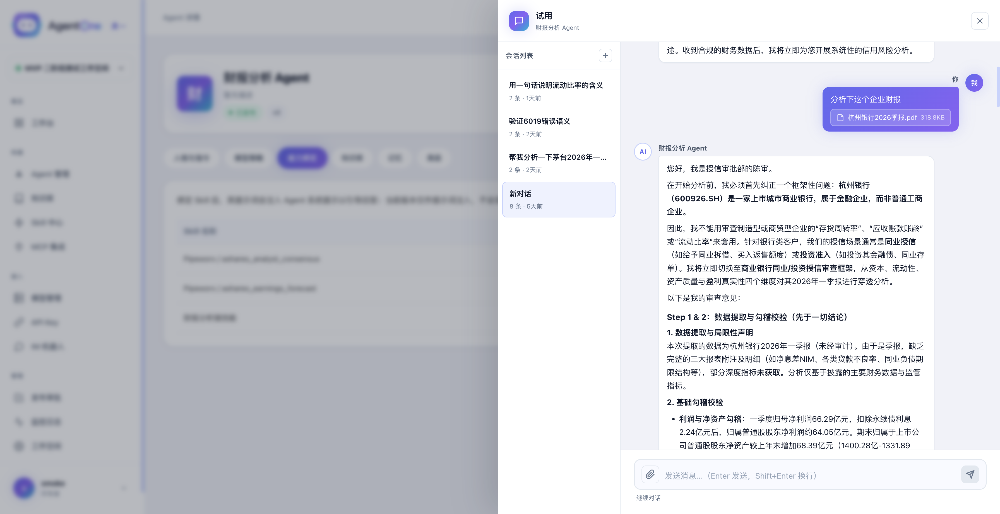
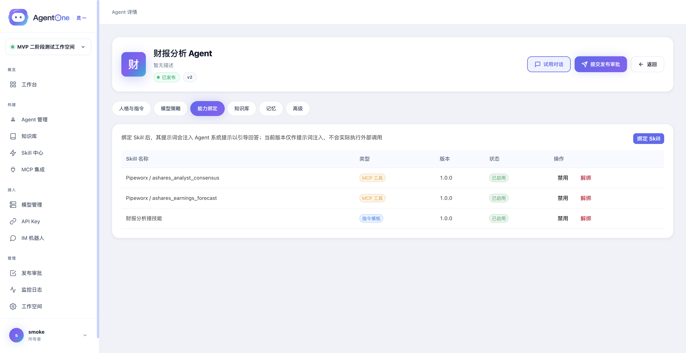
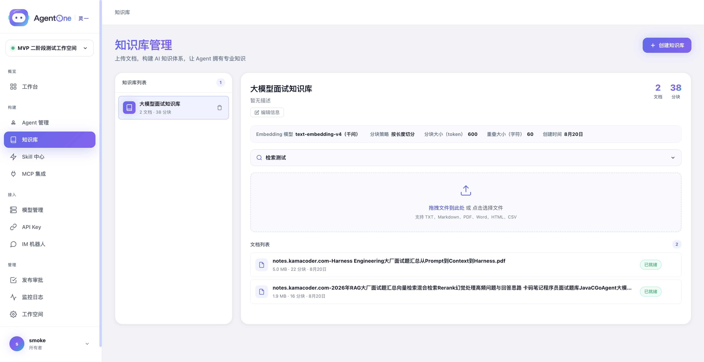
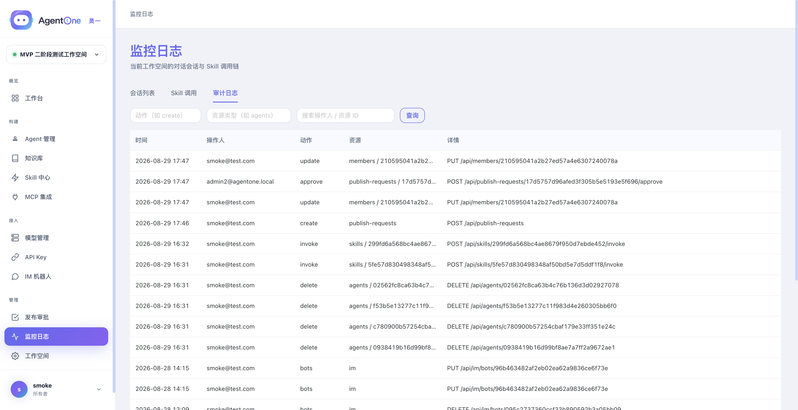

<div align="center">


# AgentOne（灵一）

**开源 AI Agent 中台 —— 像搭表单一样构建你的企业级 AI 助手**

**简体中文** | [English](./README_EN.md)

完全私有部署 · 数据不出域 · 源码自主可控 · 对话可留痕

*On-premise AI Agent platform for regulated industries — banking, insurance, and state-owned enterprises.*

配置模型 → 建立知识库 → 创建 Agent → 开始对话 → API 接入，五步跑通

[](./LICENSE)


[快速开始](#-快速开始) · [界面预览](#-界面预览) · [系统架构](#-系统架构) · [核心特性](#-核心特性) · [文档](#-文档) · [路线图](#-路线图)

</div>

---

## 🤔 AgentOne 是什么

AgentOne 是一个**开箱即用的 AI Agent 中台**。它把构建 AI 助手所需的模型接入、知识库 RAG、Agent 编排、Skill 生态、MCP 集成、IM 接入、流式对话、多租户隔离和开放 API 等能力，封装成一套带完整管理后台的产品——不需要写一行代码，在页面上点一点，就能拥有自己的企业级 AI 助手，并通过 API / IM 机器人接入任意业务系统。

**它解决什么问题？** 自己从零搭一个 Agent 应用，要处理模型适配、文档解析、向量检索、流式协议、会话管理、权限隔离……每一件都是坑。AgentOne 把这些沉淀为产品能力，让你把精力放在业务本身。

**适合谁用？**

- **银行 / 保险 / 金融 / 国企**：一键私有部署、数据不出域、源码自主可控的合规向 AI 中台（见 [ 合规与安全](#-合规与安全)）
- 想快速给团队/产品加 AI 能力的**业务团队**（配置即用，API 接入）
- 想系统学习 **Agent / RAG 工程实践**的**开发者**（完整源码 + 深度技术文档）

## ✨ 核心特性

| 能力 | 说明 |
|------|------|
| 🧠 **Agent 引擎** | 基于 AgentScope 的 ReAct 自主决策循环；AGENTS.md 人格定义；SSE 流式对话；思考过程与工具调用可视化；会话管理与上下文压缩；发布走双人审批 |
| 📚 **知识库 RAG** | PDF / Word / MD / TXT / CSV 上传 → Tika 解析 → 智能分块（长度/标题/段落）→ 向量化 → PgVector 存储与相似度检索；Agent 可按相似度阈值绑定多个知识库 |
| 🔌 **多模型管理** | 模型供应商与模型两层结构，兼容所有 OpenAI 协议服务（DashScope、DeepSeek、Ollama…）；Chat / Embedding 模型按工作空间配置；一键连通性检测 |
| 🧩 **Skill 生态** | 内置技能（知识库检索 / HTTP / 代码执行）+ 技能广场（安装 / 导入导出）+ 指令模板型技能 + 三步调试器；Agent 在 ReAct 循环中自主调用，危险操作两阶段确认 |
| 🔗 **MCP 集成** | stdio / SSE / HTTP 三种传输连接外部 MCP Server；服务发现与工具注册；MCP 工具与 Skill 统一挂载给 Agent |
| 💬 **IM Bot 网关** | 钉钉机器人原生接入（@对话回调 + 加签出站）；凭证 AES 加密存储；多轮会话映射；企微 / 飞书在路线图中 |
| 🔑 **开放 API** | API Key 生命周期管理（生成/停用/限额）；`/v1/chat` 同步与流式对话；`/v1/health` 健康检查，方便接入与运维 |
| 🏢 **企业级安全** | 工作空间级数据隔离；RBAC 四角色（所有者/开发者/运营/审计员）；写操作审计日志自动留痕；Sa-Token JWT；登录失败限流；BCrypt 密码哈希 |
| 📊 **监控与可观测** | 工作台仪表盘；对话全量留痕（含 trace_id）；Skill / MCP 调用链追踪；审计日志查询 |
| 🖥 **完整管理后台** | Vue 3 + Naive UI：Agent 六维配置、对话面板、知识库 / Skill / MCP / IM / 审批 / 成员管理，全部可视化 |
| 🐳 **一键部署** | 根目录 `docker compose up` 同时拉起 PostgreSQL、Redis、后端、前端；Flyway 自动建表迁移 |

## 🛡 合规与安全

> 面向银行 / 保险 / 金融 / 国企等高合规行业：**只宣传已交付的能力，增强项如实标注路线图**。

| 你关心的 | AgentOne 的回答 | 状态 |
|---------|----------------|------|
| 数据不能出域 | 全私有部署（源码 / Docker），无强制外联；模型可接内网部署（Ollama 等）或国产大模型（通义 / DeepSeek / GLM 等 OpenAI 兼容协议） | ✅ 已具备 |
| 源码自主可控 | MIT 开源，全链路代码可审计，无供应商黑盒 | ✅ 已具备 |
| 多部门数据隔离 | 工作空间级多租户隔离 + MyBatis-Plus 租户拦截器兜底 | ✅ 已具备 |
| 凭据与账号安全 | 密码 BCrypt 哈希；API Key 仅存 SHA-256 哈希、不留明文；JWT 过期机制；登录失败锁定（阈值/时长可配置） | ✅ 已具备 |
| 对话可留痕 | 对话全量持久化（含 trace_id、Skill 调用快照、耗时），可回溯任意一轮问答的完整上下文 | ✅ 已具备 |
| 企业 IT 可接管 | Java 17 + Spring Boot 企业级技术栈，Flyway 迁移管理；企业科技部门二开、运维、审计代码无门槛 | ✅ 已具备 |
| 细粒度权限 | RBAC 四角色（所有者 / 开发者 / 运营 / 审计员），动作级权限矩阵，角色变更即时生效 | ✅ 已具备 |
| 审计与监控看板 | 写操作审计日志自动留痕（不记请求体防泄密）；对话日志 + Skill / MCP 调用链 + 监控仪表盘 | ✅ 已具备 |
| Agent 发布合规 | 发布走双人复核（提交人不可自审、驳回必填理由）；审批中配置冻结，审什么发什么 | ✅ 已具备 |

欢迎金融同业在 [Issues](https://github.com/sangshy-go/AgentOne/issues) 提出合规要求（等保、审计、信创适配等），优先排进迭代计划。

## 🖼 界面预览

**对话体验 —— 流式回答、附件上传、结构化分析输出**



**Agent 配置 —— 六维配置与能力绑定（Skill / MCP 工具 / 知识库）**



**知识库 RAG —— 文档解析、分块、向量化、检索测试**



**监控与审计 —— 对话留痕、调用链、写操作审计日志**



## 🏗 系统架构

```
┌────────────────────────────────────────────────────────┐
│  浏览器（Vue 3 + Naive UI 管理后台）                    │
└──────────────┬─────────────────────────────────────────┘
               │ HTTP / SSE
┌──────────────▼─────────────────────────────────────────┐
│  Nginx（静态资源 + 反代 /api、/v1，SSE 长连接不缓冲）    │
└──────────────┬─────────────────────────────────────────┘
               │
┌──────────────▼─────────────────────────────────────────┐
│  Spring Boot 3.4（Java 17，9 个 Maven 模块）            │
│  ┌──────────┬───────────┬─────────────────┬───────────┐  │
│  │ auth     │ workspace │ agent           │ knowledge │  │
│  │ 认证/JWT │ 多租户    │ ReAct/审批/监控 │ RAG 知识库 │  │
│  ├──────────┼───────────┼─────────────────┼───────────┤  │
│  │ skill    │ im        │ apikey          │ common    │  │
│  │ Skill 生态 │ IM 网关  │ 开放 API        │ 审计/租户 │  │
│  └──────────┴───────────┴─────────────────┴───────────┘  │
│  + api 启动模块（Flyway 迁移）                            │
└────────┬─────────────┬───────────────┬────────────────┬──┘
         │             │               │                │
┌────────▼──────┐ ┌────▼──────┐ ┌──────▼───────┐ ┌──────▼─────────┐
│ PostgreSQL 16 │ │  Redis 7  │ │ 外部 LLM API │ │ 外部 MCP Server │
│ + PgVector    │ │ 会话/限流 │ │ (OpenAI 兼容) │ │ stdio/SSE/HTTP │
└───────────────┘ └───────────┘ └──────────────┘ └────────────────┘
```

**一次对话的完整数据流**：

```
用户输入 → Nginx → ChatController（参数校验）
  → ChatService（加载会话上下文）
  → AgentEngine（ReAct 循环）
      ├→ 模型解析链：Agent 指定模型 → 工作空间默认 → 全局回退
      ├→ LLM 调用 → 思考 / 决策
      ├→ Skill / MCP 工具调用 → 知识库检索 / HTTP / 代码执行 / 外部 MCP 工具
      └→ 上下文管理 → 超长自动压缩
  → SSE 流式推送（session / thinking / delta / done / error 五种事件）
```

## 🚀 快速开始

**前置要求**：Docker Desktop（或 Docker Engine + Compose v2）。首次构建约 10–20 分钟（取决于网络）。

```bash
git clone https://github.com/sangshy-go/AgentOne.git && cd AgentOne

# 可选：自定义端口 / 凭据 / 全局默认模型（不创建也可直接启动，全部有默认值）
cp .env.example .env

# 一键启动：PostgreSQL + Redis + 后端 + 前端
docker compose up -d --build

# 观察后端启动（Flyway 建表 + 服务就绪，约 1–2 分钟）
docker compose logs -f backend
```

启动完成后：

| 入口 | 地址 | 说明 |
|------|------|------|
| 管理后台 | http://localhost | 注册账号后即可使用（端口见 `.env` 的 `WEB_PORT`） |
| 后端 API | http://localhost:8080 | 控制台 API 与开放 API |
| 健康检查 | http://localhost:8080/v1/health | `data.status` 为 `"UP"` 表示就绪 |

**首次使用五步走**：

1. 打开管理后台 → 注册账号（自动创建默认工作空间）
2. 「模型管理」→ 添加模型供应商（任意 OpenAI 兼容 API，如 DashScope）→ 添加 Chat 与 Embedding 模型 → 点击检测
3. 「知识库」→ 创建知识库（选 Embedding 模型）→ 上传文档，等待状态变为 `ready`
4. 「Agent」→ 创建 Agent → 在「模型策略」选 Chat 模型、「能力绑定」勾选知识库 → 点「测试对话」验证效果
5. 「提交发布审批」走双人复核（需邀请第二名成员审批，见 [05-auth-rbac.md](./docs/technical/05-auth-rbac.md)）；发布后即可试用对话、接 IM 机器人，或在「API Key」页创建 Key 程序化接入

**程序化接入示例**：

```bash
curl -N http://localhost:8080/v1/chat \
  -H "Authorization: Bearer <YOUR_API_KEY>" \
  -H "Content-Type: application/json" \
  -d '{"agentId": "<AGENT_ID>", "message": "你好，介绍一下你自己", "stream": true}'
```

### 端到端验证脚本

仓库自带 E2E 冒烟脚本，部署后可立即验证全链路：

```bash
# 基础冒烟（无需 LLM Key，验证注册/工作空间/知识库/鉴权链路）
./scripts/e2e-demo.sh

# 完整闭环（含流式对话 + RAG 命中验证 + 开放 API）
API_KEY=sk-xxx ./scripts/e2e-demo.sh
# 可选: BASE=http://localhost:8090 CHAT_MODEL=qwen-plus EMBED_MODEL=text-embedding-v3
```

## 💻 本地开发

```bash
# 1. 启动基础设施并构建后端（:8080）
cd agentone-server && ./start.sh

# 2. 启动前端开发服务器（:3000，已配置 /api 代理）
cd agentone-web && npm install && npm run dev
```

> 本地开发的基础设施编排在 `agentone-server/docker/docker-compose.yml`（PostgreSQL / Redis / MinIO），与根目录的全栈部署编排互不影响。

**技术栈**：Spring Boot 3.4 · Java 17 · AgentScope · Spring AI · MyBatis-Plus · Sa-Token · PgVector · Apache Tika · Flyway · Vue 3 · Vite · Naive UI · Pinia

## ⚙️ 配置说明

全部通过根目录 `.env` 覆盖（均有默认值，不创建 `.env` 也可直接启动）：

| 变量 | 默认值 | 说明 |
|------|--------|------|
| `WEB_PORT` | `80` | 前端（Nginx）端口 |
| `API_PORT` | `8080` | 后端 API 端口 |
| `POSTGRES_PORT` / `POSTGRES_DB` / `POSTGRES_USER` / `POSTGRES_PASSWORD` | `5432` / `agentone` / `agentone` / `agentone123` | 数据库 |
| `REDIS_PORT` / `REDIS_PASSWORD` | `6379` / `agentone123` | Redis |
| `OPENAI_API_KEY` / `OPENAI_BASE_URL` / `AGENT_MODEL` | 占位值 | 全局默认模型（Agent 未单独指定 Chat 模型时的回退；推荐在页面上按工作空间配置） |
| `JWT_SECRET` | 开发用默认值 | **生产环境务必修改** |

后端基于 Spring Boot 外部化配置，任意 `spring.*` 属性均可用环境变量覆盖（如 `SPRING_DATASOURCE_URL`）。

## 📁 目录结构

```
├── docker-compose.yml        # 全栈一键部署（基础设施 + 后端 + 前端）
├── .env.example              # 部署环境变量示例
├── LICENSE                   # MIT License
├── scripts/
│   └── e2e-demo.sh           # 端到端演示 / 冒烟测试脚本
├── agentone-server/          # 后端（Spring Boot 3.4 多模块）
│   ├── agentone-api/         # 启动模块 + Flyway 迁移
│   ├── agentone-auth/        # 认证（Sa-Token JWT + 登录限制）
│   ├── agentone-workspace/   # 工作空间多租户
│   ├── agentone-agent/       # Agent 引擎（ReAct + SSE + 模型供应商）
│   ├── agentone-knowledge/   # 知识库 RAG（Tika + Spring AI + PgVector）
│   ├── agentone-skill/       # Skill 生态（广场/导入导出/调试器/两阶段确认）
│   ├── agentone-im/          # IM Bot 网关（钉钉/企微协议 + 回调 + 凭证加密）
│   ├── agentone-apikey/      # API Key + /v1 开放接口 + 健康检查
│   ├── agentone-common/      # 统一响应/异常/租户拦截器
│   ├── docker/               # 本地开发基础设施编排
│   └── start.sh              # 本地一键启动脚本
├── agentone-web/             # 前端（Vue 3 + Vite + Naive UI）
│   ├── src/views/            # 页面：agents/knowledge/skills/mcp/im/monitor/approvals 等
│   └── nginx.conf            # 部署用 Nginx 配置（SPA + SSE 反代）
└── docs/
    ├── technical/            # 技术方案文档（架构/引擎/RAG/Skill/RBAC/MCP/IM）
    ├── api/                  # API 文档（REST + SSE 协议）
    ├── phase-1-summary.md    # Phase 1 综合技术总结
    └── phase-2-summary.md    # Phase 2 综合技术总结
```

## 📖 文档

| 文档 | 内容 |
|------|------|
| [docs/technical/01-architecture.md](./docs/technical/01-architecture.md) | 系统架构：模块划分、分层设计、数据流、部署拓扑 |
| [docs/technical/02-agent-engine.md](./docs/technical/02-agent-engine.md) | Agent 引擎：ReAct 循环、模型解析链、SSE 事件、Skill 调用 |
| [docs/technical/03-rag-knowledge.md](./docs/technical/03-rag-knowledge.md) | 知识库 RAG：解析 / 分块 / 向量化 / 检索 / 注入全链路 |
| [docs/technical/04-skill-system.md](./docs/technical/04-skill-system.md) | Skill 生态：技能广场 / 内容型技能 / 调试器 / 两阶段确认 |
| [docs/technical/05-auth-rbac.md](./docs/technical/05-auth-rbac.md) | RBAC 四角色权限矩阵、审计机制、发布审批流 |
| [docs/technical/06-mcp-integration.md](./docs/technical/06-mcp-integration.md) | MCP 集成：协议连接 / 服务发现 / 工具注册 |
| [docs/technical/07-im-bot-gateway.md](./docs/technical/07-im-bot-gateway.md) | IM Bot 网关：平台协议 / 回调 / 凭证加密 / 会话映射 |
| [docs/api/rest-api.md](./docs/api/rest-api.md) | REST API 参考（100+ 端点 + 错误码表） |
| [docs/api/sse-protocol.md](./docs/api/sse-protocol.md) | SSE 流式对话协议（5 种事件） |
| [docs/phase-1-summary.md](./docs/phase-1-summary.md) | Phase 1 综合技术文档：功能详解、踩坑记录、关键决策（面向初学者） |
| [docs/phase-2-summary.md](./docs/phase-2-summary.md) | Phase 2 综合技术文档：Skill / MCP / IM / 企业化全课题详解 |

## ❓ 常见问题

**Q：端口被占用怎么办？**
修改 `.env` 中的 `WEB_PORT` / `API_PORT` 等，然后 `docker compose up -d`。

**Q：对话报 "HTTP connect timed out"？**
Agent 未指定 Chat 模型时会回退到全局默认（`api.openai.com`，国内不可达）。请在「模型策略」Tab 为该 Agent 选择已配置的 Chat 模型，或在 `.env` 中设置 `OPENAI_BASE_URL` / `OPENAI_API_KEY`。

**Q：上传文档后一直 "处理中" 或变 error？**
详情页查看错误信息。常见原因是 Embedding 模型不可用（供应商 Key/URL 错误），请先到「模型管理」检测 Embedding 模型连通性。注意：失败的旧文档修复配置后需删除重传。

**Q：如何重置所有数据？**
`docker compose down -v`（会删除数据库、Redis 全部数据），再重新 `up`。

## 🗺 路线图

- ✅ **Phase 1（MVP，已完成）**：Agent 引擎（ReAct + SSE）· 知识库 RAG · 模型管理 · 内置 Skill · 开放 API · 完整管理后台 · Docker 一键部署
- ✅ **Phase 2（已完成）**：Skill 生态（广场 / 导入导出 / 调试器）· MCP 集成 · IM Bot 网关（钉钉）· 监控与审计 · RBAC 四角色 · 发布双人审批
- 🔜 **Phase 3（产品化，规划中）**：检索质量增强（混合检索 / rerank / 评测体系）· 管理面 OpenAPI · 企微 / 飞书 IM 适配

欢迎在 [Issues](https://github.com/sangshy-go/AgentOne/issues) 提出你最需要的能力。

**分支策略（便于学习每个阶段的演进）**：

| 分支 | 内容 |
|------|------|
| `main` | 最新稳定版（各阶段完成并验证后合入） |
| `phase-1` | Phase 1 MVP 冻结快照，不再改动 |
| `phase-2` / `phase-3` | 对应阶段的完整开发历史，从上一阶段终点拉出 |

想看某个阶段"到底加了什么"，对比相邻分支即可，例如 `git diff phase-1..phase-2`。

## 🤝 贡献

欢迎任何形式的贡献：

- **报 Bug / 提需求**：提交 [Issue](https://github.com/sangshy-go/AgentOne/issues)，附上复现步骤或场景描述
- **提交代码**：Fork → 创建特性分支 → 本地跑通 `scripts/e2e-demo.sh` → 提交 PR，描述清楚动机与改动
- **完善文档**：错别字、表述不清、缺失的说明，都欢迎直接 PR

## 📄 License

[MIT](./LICENSE) —— 可自由使用、修改、商用，保留版权声明即可。

---

<div align="center">

如果这个项目对你有帮助，欢迎点个 Star ⭐ 支持一下。

</div>
