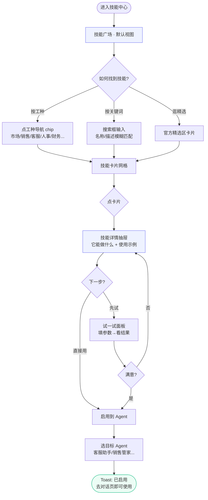
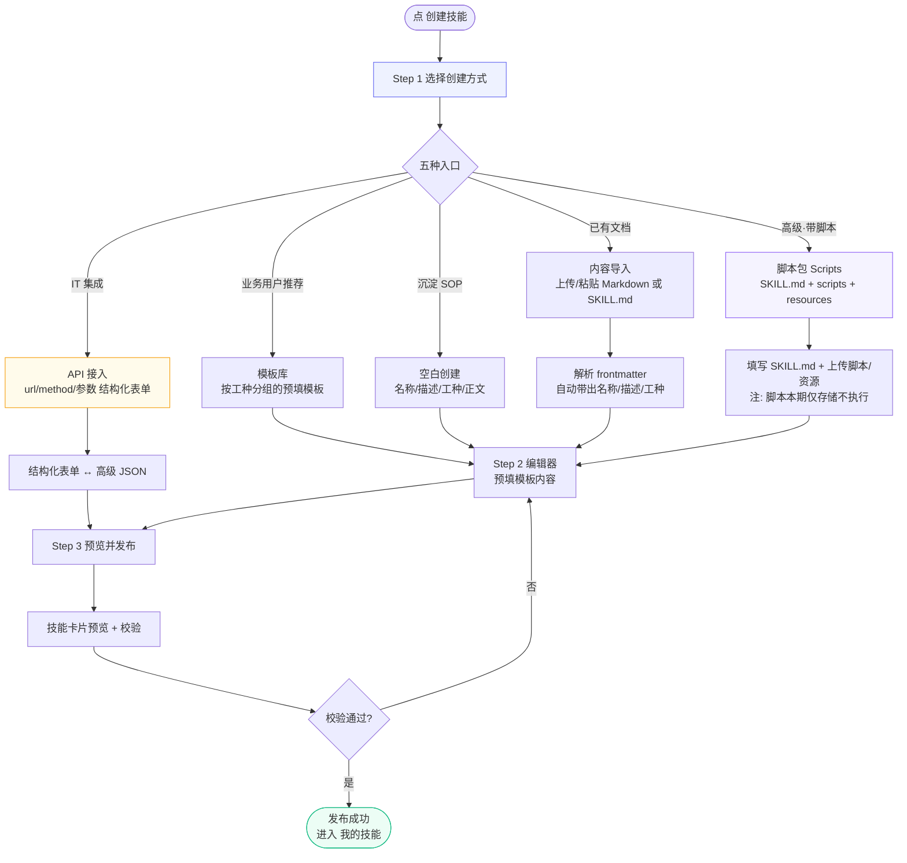
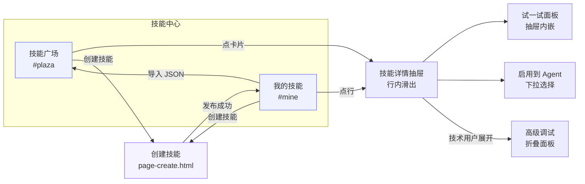
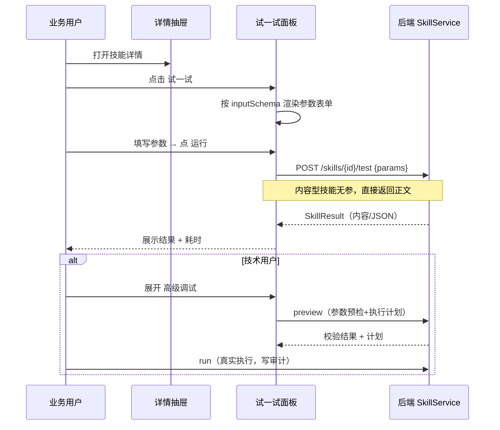
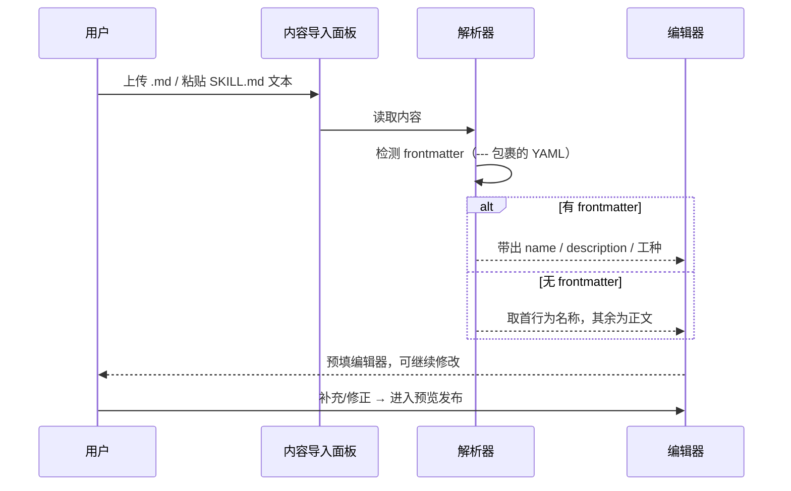

# Skill 中心 v2 — 交互流程图

> 目标：重定位「面向中小企业所有工种」的技能中心。核心转变——从「技能资产管理」视角
> （列表/创建/调试并列）转为「能力发现 + 能力管理」双视角：
> - **技能广场**（发现）：按工种导航、搜索、精选、卡片、详情抽屉、试一试、启用到 Agent
> - **我的技能**（管理）：已安装技能的启停、使用统计、编辑、导出
> - **调试降级**：三步向导从顶级 Tab 降为详情抽屉内的行内动作
> - **创建多入口**：模板库 / 空白 / 内容导入（SKILL.md）/ 脚本包（Scripts）/ API 接入

---

## 1. 用户主流程（发现并使用一个技能）

业务用户（HR / 销售 / 客服等非技术角色）带着业务问题来，3 步内用上技能。

---

## 2. 创建技能流程（多入口）

---

## 3. 页面跳转图

> 实线 = 主导航；抽屉/面板为行内滑出，非独立路由页。

---

## 4. 核心交互时序图

### 4.1 试一试（调试降级后的行内形态）

### 4.2 内容导入（SKILL.md → 技能）

---

## 5. 状态与边界

| 场景 | 处理 |
|------|------|
| 广场无搜索结果 | 空态插画 + 「换个关键词，或按工种浏览」+ 创建技能入口 |
| 我的技能为空 | 空态 + 「从广场安装」/「创建第一个技能」双按钮 |
| 技能已被 Agent 绑定 | 删除时拦截，提示先解绑（错误码 5005） |
| 内置/MCP 技能 | 虚拟挂载，不可编辑/删除，仅可启停与试用 |
| 脚本包技能 | 标注「脚本暂不执行」，避免误导 |
